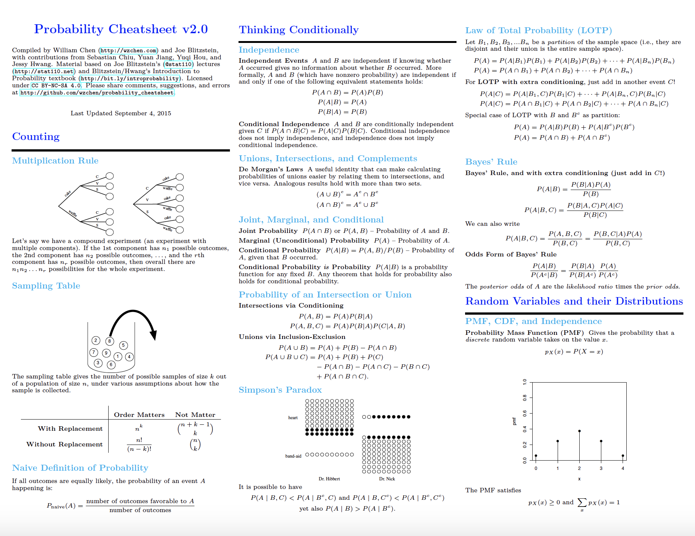
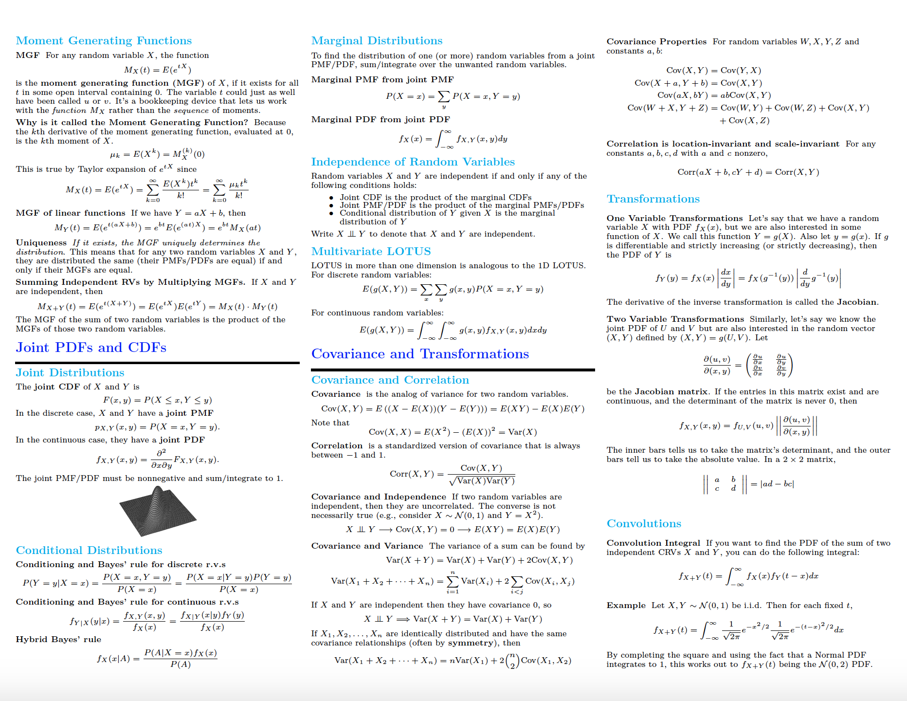
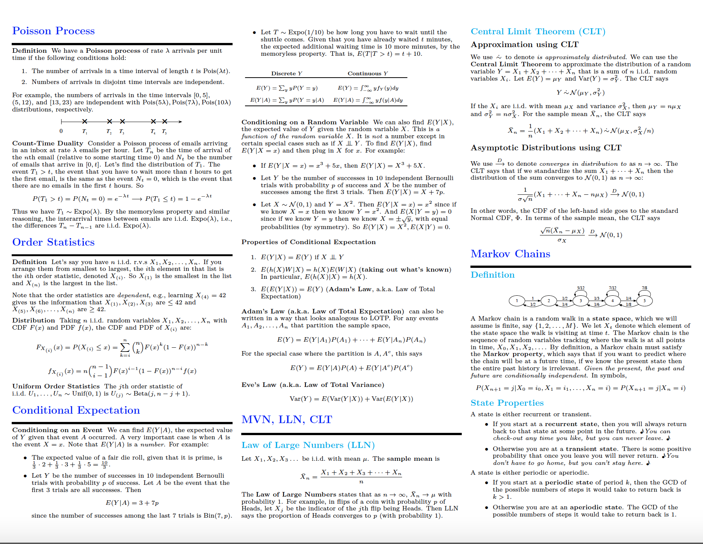
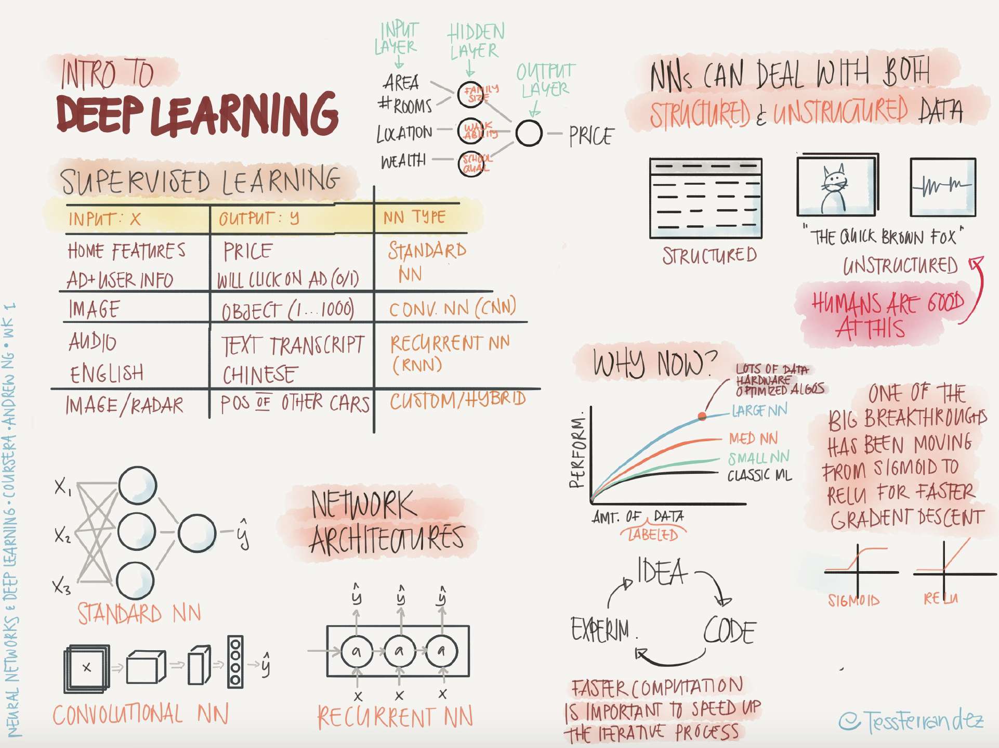
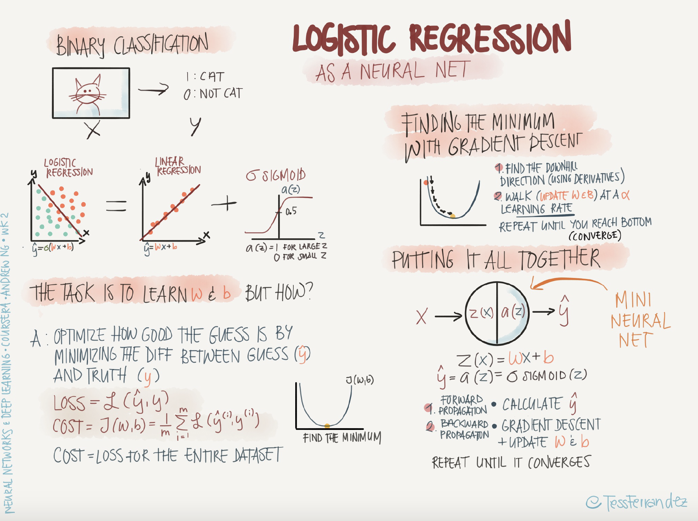
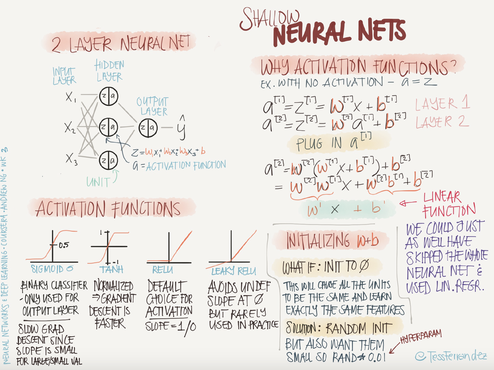
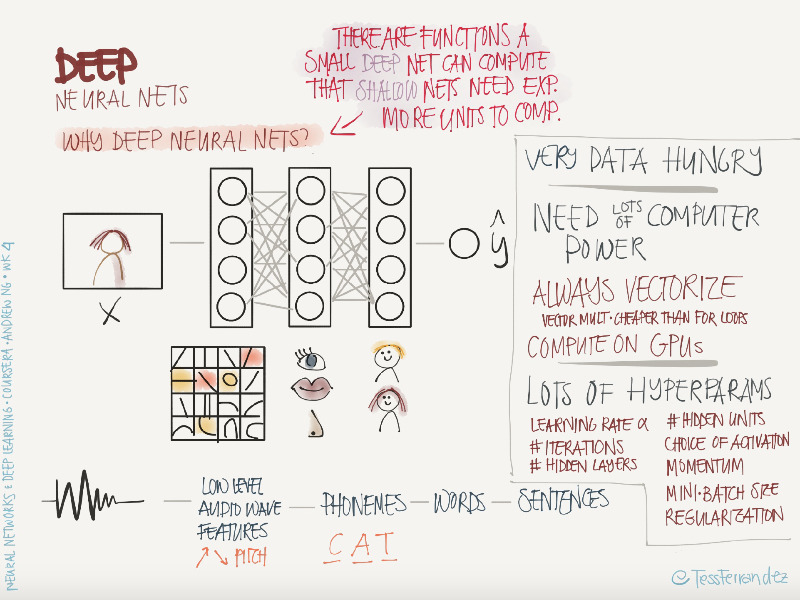

# Data Science Cheat Sheets and Study Materials

## Probability Cheat Sheet ()
[Deep Learning Cheat Sheet](materials/ProbabilityCheatSheet.pdf "Probability Notes")

  
  

## Deep Learning Cheat Sheet (Andrew NG - Deep Learning Course)
[Deep Learning Cheat Sheet](materials/DeepLearningNotes.pdf "Deep Learning Notes")

  
  
