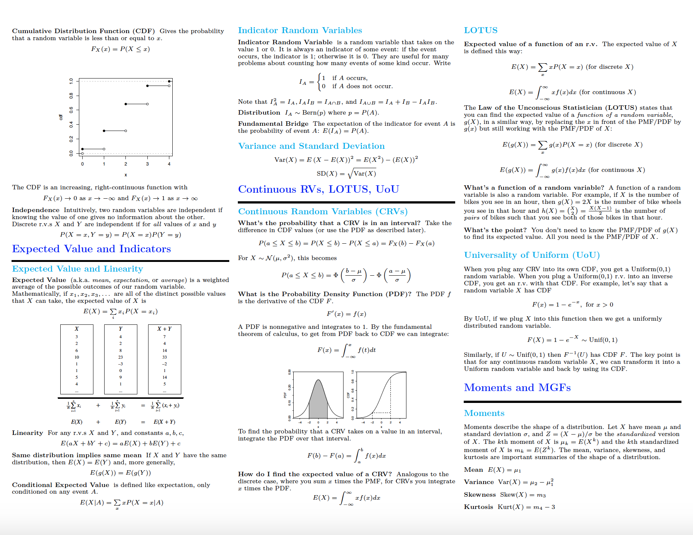
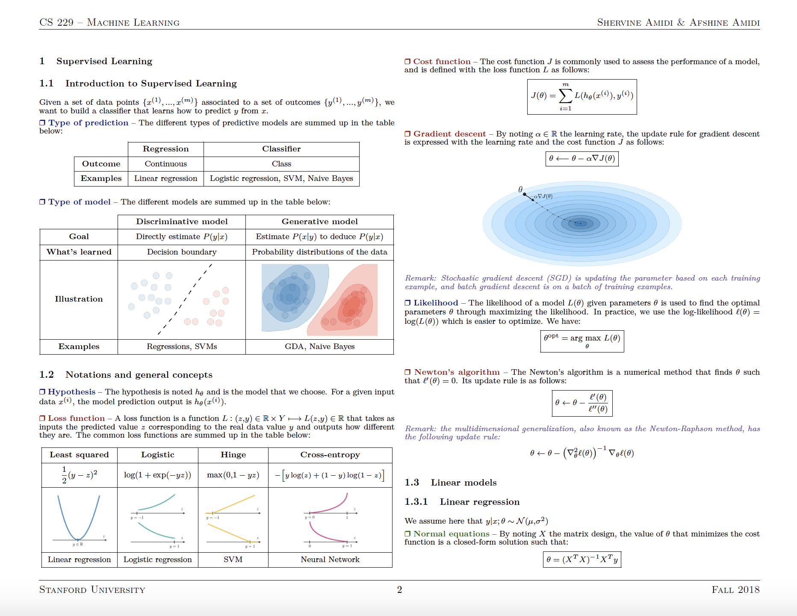

# Data Science Cheat Sheets and Study Materials

## Probability Cheat Sheets
[Probability](materials/ProbabilityCheatSheet.pdf "Probability Notes"){:target="_blank"}

  
  

## Stats Cheat Sheets
[Stats (Harvard Stat 100)](materials/StatsCheatSheet.pdf "Stats Notes"){:target="_blank"}

  
  

## Machine Learning Cheat Sheets
[Machine Learning (Stanford CS229)](materials/MLCheatSheet.pdf "ML Notes"){:target="_blank"}

  
  

[Advice for Applying Machine Learning (Stanford CS229)](materials/MLAdviceAndrewNG.pdf "ML Advice Notes"){:target="_blank"}

  
  

## Machine Learning Books
[100 Page Machine Learning Book (Andriy Burkov)](materials/100MLBook.pdf "ML Notes"){:target="_blank"}

  
  

[Machine Learning Equations Manual](materials/MLCheatSheetTechnicalBook.pdf "ML Notes"){:target="_blank"}

  
  

## Deep Learning Cheat Sheets
[Deep Learning Notes (from Andrew NG's class)](materials/DeepLearningNotes.pdf "Deep Learning Notes"){:target="_blank"}

  
  
